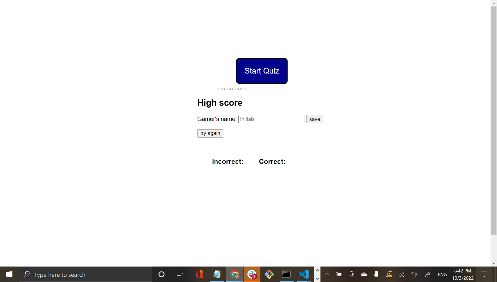

# Timed Quiz

## Deployable Link
https://elduderino23.github.io/apparao_vasu_quiz/

## Goal
The task was to make timed quiz from scratch. It needed to be multiple choice, a timer, and a score sheet where the user could input their name into a form and the score is shown next to the name itself.

## Technology Use
  - Javascript
  - VS Code
  - Git Bash 
  - GitHub

## Execution

The plan of attack started with simply creating a bare bones HTML and CSS. The real meat and potatoes started with the javascript.
Used an array to loop questions like below
```Javascript
var question1 = ["Question 1: What is a prompt()?", "(a) displays a dialog button that prompts the user for inspection", "(b) displays a dialog button that prompts the user for direction", "(c) displays a dialog button that prompts the user for input", "(d) displays a dialog button that prompts the user for output", "c"]
var question2 = ["Question 2: What is an Array?", "(a) a special variable which holds more than five values", "(b) a special variable which holds more than one value", "(c) a special variable which holds less than one value", "(d) a variable which holds more than one value", "b"]
var question3 = ["Question 3: What are semantic HTML?", "(a) element that clearly describes its value in both browser and the developer", "(b) element that clearly describes its shape in both browser and the developer", "(c) element that clearly describes its code in both browser and the developer", "(d) element that clearly describes its meaning in both browser and the developer", "d"]
var question4 = ["Question 4: What are HTML Elements?", "(a) elements defined by start tag, some content, and an end tag", "(b) elements defined by start point, some content, and an end tag", "(c) elements defined by starter, some content, and an end tag", "(d) elements defined by start tag, some content, and an end", "a"]
var question5 = ["Question 5: What is a CSS Box Model?", "(a) a box that wraps around an HTML element", "(b) a box that wraps around every HTML", "(c) a box that wraps around some HTML element", "(d) a box that wraps around every HTML element", "d"]
var question6 = ["Question 6: What is a <br> tag?", "(a) tag inserts a basic rule", "(b) tag inserts a line break", "(c) tag inserts a breakpoint", "(d) tag inserts a line", "b"]
var question7 = ["Question 7: What is an alert box?", "(a) a box often used if you want data got through to the user", "(b) a box often used if you want facts got through to the user", "(c) a box often used if you want info got through to the user", "(d) a box often used if you want things got through to the user", "c"]
var question8 = ["Question 8: What is DOM?", "(a) Document Object Model", "(b) Document Object Method", "(c) Document Open Model", "(d) Document Object Minimum", "a"]
var question9 = ["Question 9: What is concat()?", "(a) Concatenates two or more elements", "(b)  Concatenates two or more items", "(c) Concatenates two or more objects", "(d) Concatenates two or more arrays", "d"]
var question10 = ["Question 10: What is JSON?", "(a) Javascript Opinion Notion", "(b) Javascript Option Notion", "(c) Javascript Source Object Notion", "(d) Javascript Object Notion", "d"]
var questions = [question1, question2, question3, question4, question5, question6, question7, question8, question9, question10];
```
By using an array to cycle the questions, startQuiz allows the user to start the quiz the minute the start quiz button is pressed. Then the nextQuestion function along with the shotClock function allows the quiz to cycle questions, with correct and incorrect number trackers, while the timer goes off. Each question missed subtracts six second from the timer. If too many questions are missed, the quiz is over. The displayQuestion function allows question 1 to start first and the letters a,b,c,d be the the string to 1,2,3,4. The below code shows the details: 

```Javascript
function startQuiz() {
    giveAnswer.style.display = "block";
    startBtn.style.display = "none";
    timeLeft = 67;
    incorrectAnswer = -1;
    correctAnswer = 0;
    i = 0;
    document.getElementById("timer-container").style.display = "flex"
    shotClock();
    nextQuestion(event);
}

function displayQuestion(currentQuestion) {
    timeQuestion.textContent = currentQuestion[0];
    firstOption.textContent = currentQuestion[1];
    secondOption.textContent = currentQuestion[2];
    thirdOption.textContent = currentQuestion[3];
    fourthOption.textContent = currentQuestion[4];
    currentAnswer = currentQuestion[5];

}

function nextQuestion(event) {
    var currentQuestion = questions[i];
    var checkAnswer = event.target.value;
    console.log(checkAnswer)
    console.log(currentAnswer)
    if (checkAnswer == currentAnswer) {
        correctAnswer++;
    } else {
        incorrectAnswer++;
        if (timeLeft > 7) {
            timeLeft -= 6;
        } else {
            timeLeft = 0;
            countDown.textContent = timeLeft;
            giveAnswer.style.display = "none";
        }

    }
    if (i < questions.length) {
        displayQuestion(currentQuestion);
    }
    if (i === questions.length) {
        giveAnswer.style.display = "none";
    }
    badAnswer.textContent = incorrectAnswer;
    goodAnswer.textContent = correctAnswer;
    console.log(correctAnswer);
    i++;
}

function shotClock() {
    timeInterval = setInterval(function () {
        if (timeLeft > 0) {
           
            timeLeft--;
            countDown.textContent = timeLeft;
        } else {
            clearInterval(timeInterval);

           
        }
    }, 1000);
}
```
The remaining half of the code represents all the eventlisteners buttons and the function that allows the user to submit the name into the score box and puts the number next to their name as seen below:
```Javascript
scoreRank.addEventListener("submit", function (event) {
    event.preventDefault();
    console.log("save")


    var scoreText = document.getElementById("score-text").value.trim();
    console.log(scoreText)

    if (scoreText === "") {
        return;
    }

    localStorage.setItem(scoreText, correctAnswer);
    var scoreShow = localStorage.getItem(scoreText);
    document.getElementById("user-score").textContent = scoreText + " " + scoreShow;


   
})

startBtn.addEventListener("click", startQuiz);
firstOption.addEventListener("click", nextQuestion);
secondOption.addEventListener("click", nextQuestion);
thirdOption.addEventListener("click", nextQuestion);
fourthOption.addEventListener("click", nextQuestion);
playAgain.addEventListener("click", startQuiz)
```
## Result
The end product is a functioning timed multiple choice quiz with a score sheet.
